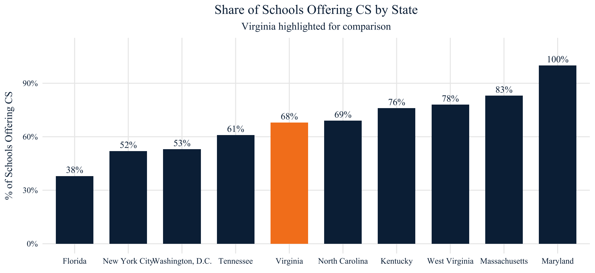
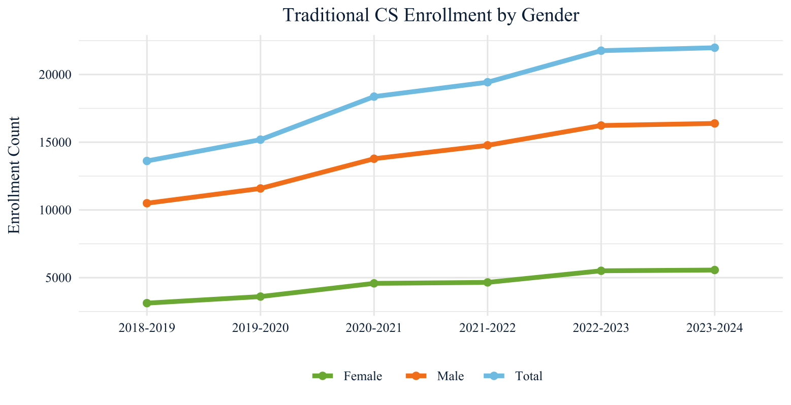
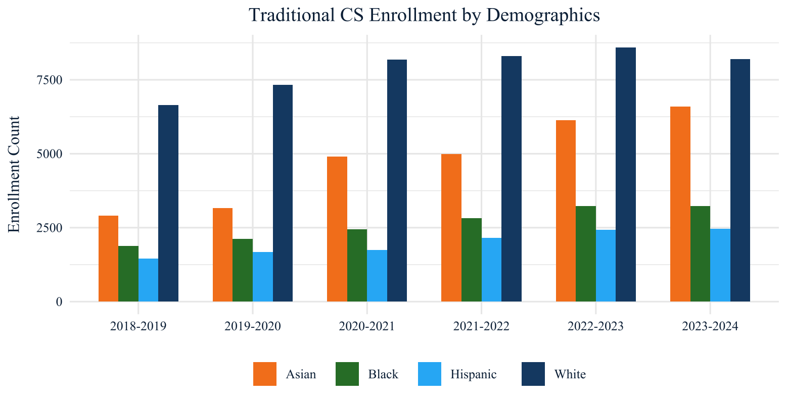
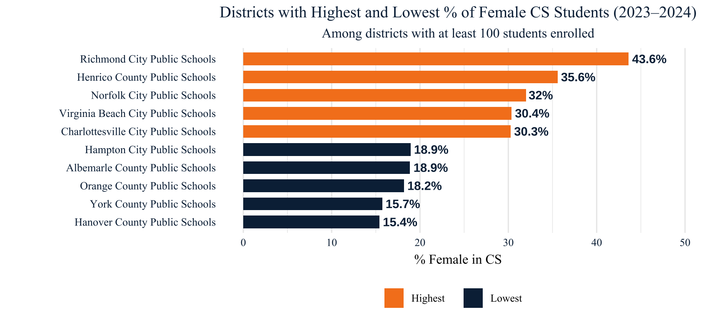
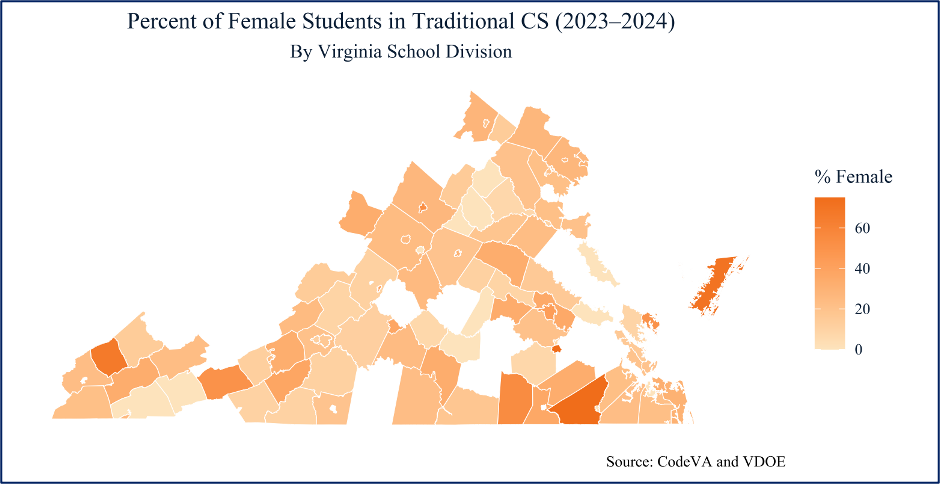

# Gender Gap in High School Computer Science — Virginia (Applied Policy Project for CodeVA)

Over the past decade, computer science (CS) has emerged as one of the fastest-growing fields in both education and the workforce. Despite national and statewide efforts to expand access to K–12 CS education, significant disparities persist, particularly along gender lines.

In Virginia, where CS is mandated across K–12 education, girls remain notably underrepresented in high school CS courses. This gender gap reflects more than differences in interest or aptitude; it signals broader patterns of exclusion rooted in classroom environments, teaching practices, early exposure, and unequal access to informal learning opportunities.

This report analyzes district-level data from the Virginia Department of Education (VDOE), aggregated to protect individual school privacy. It was prepared as part of my Applied Policy Project (APP) for CodeVA, Virginia’s leading nonprofit dedicated to K–12 computer science education. Through data exploration and visualizations, the report highlights the extent of gender disparities across Virginia’s school divisions and identifies areas where targeted interventions might have the greatest impact.

The original project assessed various strategies—including enhanced teacher training, all-girls summer camps, and expanded access to gamified online tools—evaluating each alternative in terms of cost-effectiveness, equity, feasibility, and time to impact. While this project focuses on the data analysis component, it aims to provide actionable insights to support CodeVA’s mission of building a more inclusive and equitable computer science landscape for Virginia’s students.

## Key Findings
- Girls are **consistently underrepresented**: ~**25–26%** of HS CS enrollment statewide in 2023–24.
- **Large variation by division**: some divisions approach parity; others fall well below 20%.
- Geography shows **clusters of low female representation**; performance isn’t explained by size/resources alone.
- **Most actionable lever**: gender-sensitive **teacher training** paired with course availability and targeted outreach.

> The full APP report (methods, alternatives, cost/feasibility) is available on my [LinkedIn profile](https://www.linkedin.com/in/hana-bakhit-15678f) .

## Visuals (with code)

### Important setup

<details>
<summary>Show code</summary>
  
```r

# Load libraries

library(tidyverse)
library(dplyr)
library(sf) # the primary spatial package for today
library(tigris) # to call Census boundary files
library(RColorBrewer)
library(scales)
library(readxl)
library(showtext)
#install.packages("here") #You might need to install this package 
library(here)

# CodeVA colors

codeva_darkblue <- "#0A2945"
codeva_lightblue <- "#7FC6E6"
codeva_orange <- "#F58220"
codeva_green <- "#7CB342"

#font
font_add(family = "Times New Roman", regular = "Times New Roman.ttf")
showtext_auto()

```
</details>

### 1) Share of Schools Offering CS by State (Virginia vs. Neighboring States)  

Nationally, states vary widely in how much access they provide to foundational computer science education. As shown in Figure 1, Virginia sits near the middle, with 68% of high schools offering foundational CS courses, which is slightly above the national average (Code.org Advocacy Coalition et al., 2023). This statewide statistic, however, masks important disparities in access and enrollment within Virginia’s school districts.

 

<details>
<summary>Show code</summary>

```r 
p_states <- ggplot(
  states_data %>%
    mutate(bar_color = if_else(State == "Virginia", "#F58220", "#0A2945"))  # Orange for VA, light blue for others
) +
  geom_col(aes(x = reorder(State, `% Schools Offering CS`), 
               y = `% Schools Offering CS`, fill = bar_color), width = 0.7) +
  geom_text(aes(x = State, y = `% Schools Offering CS`, 
                label = scales::percent(`% Schools Offering CS`, accuracy = 1)),
            vjust = -0.5, size = 3.5, color = "#0A2945", family = "Times New Roman", fontface = "bold") +
  scale_fill_identity() +
  scale_y_continuous(labels = scales::percent_format(accuracy = 1), limits = c(0, 1.1)) +
  labs(
    title = "Share of Schools Offering CS by State",
    subtitle = "Virginia highlighted for comparison",
    x = NULL,
    y = "% of Schools Offering CS"
  ) +
  theme_minimal(base_family = "Times New Roman") +
  theme(
    plot.title = element_text(hjust = 0.5, size = 14, face = "bold", color = "#0A2945"),
    plot.subtitle = element_text(hjust = 0.5, color = "#0A2945"),
    axis.text.x = element_text(color = "#0A2945", face = "bold"),
    axis.text.y = element_text(color = "#0A2945"),
    axis.title = element_text(color = "#0A2945"),
    panel.grid.minor = element_blank()
  )                          
ggsave("images/states_access_graph.png", p_states, width = 8, height = 6, dpi = 300)

```
</details>

### 2) Female Share of CS Enrollment by Division (VA Choropleth)

Enrollment in traditional computer science courses in Virginia high schools, such as AP Computer Science A, AP Computer Science Principles, and introductory programming, has steadily increased. However, this growth has not been equally distributed across all student demographics. Female enrollment, in particular, has seen only modest gains over the past five years. For instance, although girls now make up roughly 25% of students in these courses, this figure has remained relatively flat, increasing by only a few percentage points since 2018.



<details>
<summary>Show code</summary>

```r

# Summarize total enrollment by gender for each year
gender_trend <- schools_data2 %>%
  group_by(Year) %>%
  summarise(
    Female = sum(female, na.rm = TRUE),
    Male = sum(male, na.rm = TRUE),
    Total = sum(number_enrolled, na.rm = TRUE)
  )
# Ensure Year is a character variable (for proper plotting and grouping later)

gender_trend$Year <- as.character(gender_trend$Year)

# Reshape the data from wide to long format:
# Each row will represent one group (Female, Male, or Total) per year
gender_trend_long <- gender_trend %>%
  pivot_longer(cols = c(Female, Male, Total),
               names_to = "Group",
               values_to = "Enrollment")
#Line graph

by_gender <- ggplot(gender_trend_long, aes(x = Year, y = Enrollment, color = Group, group = Group)) +
  geom_line(size = 1.5) +
  geom_point(size = 2) +
  scale_color_manual(values = c(
    "Female" = codeva_green,
    "Male" = codeva_orange,
    "Total" = codeva_darkblue
  )) +
  labs(
    title = "Traditional CS Enrollment by Gender",
    x = NULL,
    y = "Enrollment Count",
    color = NULL
  ) +
  theme_minimal(base_family = "Times New Roman") +
  theme(
    plot.title = element_text(hjust = 0.5, face = "bold", color = codeva_darkblue),
    axis.text = element_text(color = codeva_darkblue),
    axis.title = element_text(color = codeva_darkblue),
    legend.position = "bottom",
    legend.text = element_text(color = codeva_darkblue)
  )

ggsave("images/female_share.png", by_gender, width = 8, height = 6, dpi = 300)

```
</details>

### 3) Traditional CS Enrollment by Race

While this report focuses on gender disparities in CS, enrollment patterns also reveal persistent racial and ethnic inequities. As shown in Figure 3, White and Asian students continue to make up the majority of students in traditional CS courses, while Black and Hispanic students remain significantly underrepresented. These trends point to structural barriers that may overlap with those faced by girls, particularly girls of color.



<details>
<summary>Show code</summary>

```r

race_trend <- schools_data2 %>%
  group_by(Year) %>%
  summarise(
    White = sum(white, na.rm = TRUE),
    Asian = sum(asian, na.rm = TRUE),
    Black = sum(black, na.rm = TRUE),
    Hispanic = sum(hispanic, na.rm = TRUE)
  )

#pivot to long

race_trend_long <- race_trend %>%
  pivot_longer(cols = c(White, Asian, Black, Hispanic),
               names_to = "Race",
               values_to = "Enrollment")

by_race <- ggplot(race_trend_long, aes(x = Year, y = Enrollment, fill = Race)) +
  geom_col(position = "dodge", width = 0.7) +
  scale_fill_manual(values = c(
    "White" = "#174A73",     # dark blue
    "Asian" = "#F58220",     # orange
    "Black" = "#2E7D32",     # green
    "Hispanic" = "#29B6F6"   # light blue
  )) +
  labs(
    title = "Traditional CS Enrollment by Race",
    x = NULL,
    y = "Enrollment Count",
    fill = NULL
  ) +
  theme_minimal(base_family = "Times New Roman") +
  theme(
    plot.title = element_text(hjust = 0.5, face = "bold", color = "#0A2945"),
    axis.text = element_text(color = "#0A2945"),
    axis.title = element_text(color = "#0A2945"),
    legend.text = element_text(color = "#0A2945"),
    legend.position = "bottom"
  )
ggsave("images/cs_by_race.png", by_race, plot = p, width = 8, height = 6, dpi = 300)

```
</details>

### 4) Districts with the highest and lowest % of female CS students

Analyzing enrollment trends at the district level reveals important nuances in how computer science (CS) education is accessed and experienced across Virginia. While some divisions report relatively high percentages of female participation, these figures can be misleading without context, particularly in districts with low overall CS enrollment. In such cases, a small number of female students may appear as a high percentage, even though meaningful access and representation remain limited. Additionally, missing or inconsistent data across some divisions limits the completeness of the statewide picture.



<details>
<summary>Show code</summary>

```r

plot_data <- districts_data %>%
  filter(Year == "2023-2024", number_enrolled >= 100) %>%
  arrange(pct_female) %>%
  slice(c(1:5, (n() - 4):n())) %>%
  mutate(group = if_else(row_number() <= 5, "Lowest", "Highest"))


districts_shares -> ggplot(plot_data, aes(x = reorder(Division, pct_female), y = pct_female, fill = group)) +
  geom_col(width = 0.7) +
  geom_text(aes(label = paste0(round(pct_female, 1), "%")), 
            hjust = -0.1, size = 3.5, color = "#0A2945", fontface = "bold") +
  coord_flip(clip = "off") +
  scale_fill_manual(values = c("Highest" = "#F58220", "Lowest" = "#0A2945")) +  # CodeVA orange & light blue
  labs(
    title = "Districts with Highest and Lowest % of Female CS Students (2023–2024)",
    subtitle = "Among districts with at least 100 students enrolled",
    x = NULL,
    y = "% Female in CS",
    fill = NULL
  ) +
  ylim(0, max(plot_data$pct_female, na.rm = TRUE) + 5) +
  theme_minimal(base_family = "Times New Roman") +
  theme(
    plot.title = element_text(hjust = 0.5, face = "bold", color = "#0A2945"),
    plot.subtitle = element_text(hjust = 0.5, color = "#0A2945"),
    axis.text.y = element_text(size = 9, face = "bold", color = "#0A2945"),
    axis.text.x = element_text(color = "#0A2945"),
    panel.grid.major.y = element_blank(),
    legend.position = "bottom"
  )
ggsave("images/cs_by_districts.png", districts_shares, plot = p, width = 8, height = 6, dpi = 300)

```
</details>


### 5) Female Representation in High School Computer Science Enrollment by School Division, Virginia (2023–2024)

The heat map shows the percentage of female students in high school CS courses across Virginia’s school divisions during the 2023–2024 academic year. Darker shades indicate higher female representation, while lighter shades reflect lower participation. Most divisions fall within the 0 to 20 percent range, highlighting the widespread underrepresentation across the state.
These patterns suggest that gender disparities are not solely a function of course availability or district size. Instead, they may reflect differences in local outreach, instructional practices, and broader cultural or structural barriers that influence whether students see CS as accessible or relevant. Simply offering CS courses, while necessary, is not sufficient to ensure equitable participation.
For example, Fairfax County Public Schools, the ninth-largest district in the United States and the highest in total CS enrollment in Virginia, reports that only 25 percent of its CS students are female.
This illustrates that gender gaps persist even in large, well-resourced divisions and reinforces the need for intentional recruitment and retention strategies beyond access alone.




<details>
<summary>Show code</summary>

```r

#filter for only Virginia 
district_boundaries <- district_boundaries %>%
  filter(STATEFP == "51")  # 51 = Virginia
#change var name to match 

district_boundaries <- district_boundaries %>%
  rename(Division = NAME)


# Join data (update "NAME" to match shapefile's district name column)
districts_data <- district_boundaries %>%
  full_join(districts_data, by = "Division")

#Map graph 

districts_map -> ggplot(
  districts_data %>%
    filter(Year == "2023-2024")
) +
  geom_sf(aes(fill = pct_female), color = "white", size = 0.1) +
  scale_fill_gradient(
    low = "#fee8c8", high = "#F58220",
    na.value = "gray90", name = "% Female"
  ) +
  labs(
    title = "Percent of Female Students in Traditional CS (2023–2024)",
    subtitle = "By Virginia School Division",
    caption = "Source: CodeVA and VDOE"
  ) +
  theme_minimal(base_family = "Times New Roman") +
  theme(
    plot.title = element_text(hjust = 0.5, face = "bold", color = "#0A2945"),  # CodeVA dark blue
    plot.subtitle = element_text(hjust = 0.5, color = "#0A2945"),
    legend.title = element_text(color = "#0A2945"),
    legend.text = element_text(color = "#0A2945"),
    axis.text = element_blank(),
    axis.title = element_blank(),
    panel.grid = element_blank()
  )

ggsave("images/cs_map.png", districts_map, plot = p, width = 8, height = 6, dpi = 300)

```
</details>


## Shapefile Data
This project uses Virginia school district boundaries from the U.S. Department of Education's NCES national shapefile:

[NCES School District Boundaries - Current](https://data-nces.opendata.arcgis.com/datasets/school-district-boundaries-current/explore)

Due to large file size, the shapefiles are not included in this repository. To replicate the analysis:

1. Download the national shapefile from the NCES link above.
2. Save the shapefile files into this folder:

```
School_District_Boundaries_-_Current/
```

3. The R Markdown code filters this shapefile for Virginia using:

```r
district_boundaries <- st_read("School_District_Boundaries_-_Current/your_shapefile.shp") %>%
  filter(STATEFP == "51")
```

## Data Privacy Note

All data shared in this repository is aggregated at the district level.

## Data Sources

- Virginia Department of Education
- CodeVA
- U.S. Department of Education NCES

## License

MIT License
